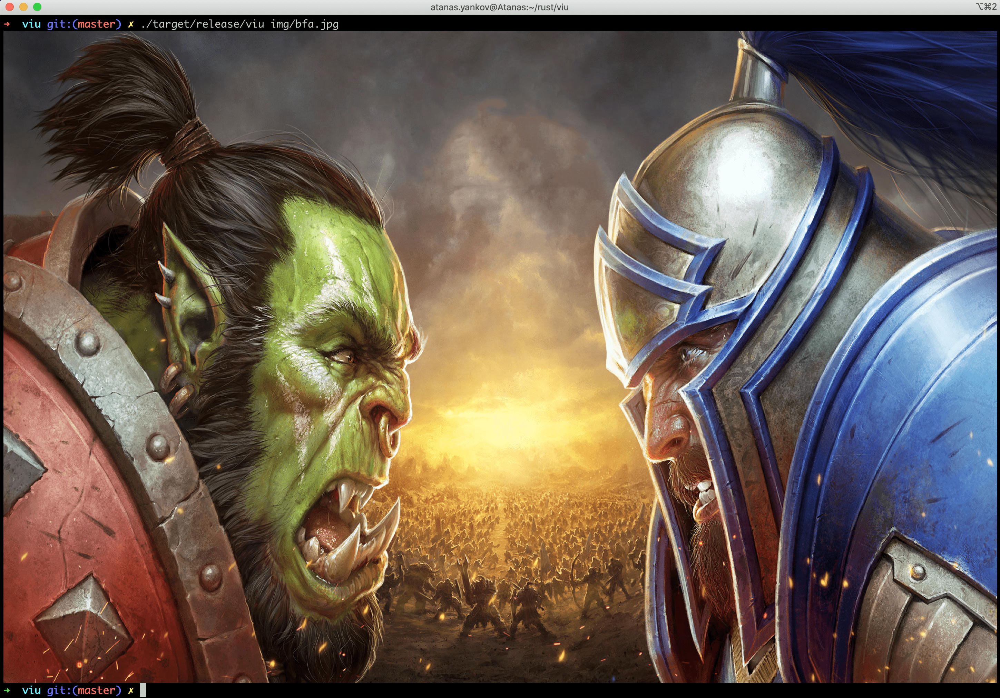

- [Description](#description)
- [Features](#features)
- [Installation](#installation)
  - [From source (recommended)](#from-source-recommended)
  - [Binary](#binary)
  - [Packages](#packages)
    - [MacOS](#macos)
    - [Arch Linux](#arch-linux)
    - [NetBSD](#netbsd)
- [Usage](#usage)
  - [Examples](#examples)
  - [iTerm note](#iterm-note)
  - [Aspect Ratio](#aspect-ratio)
  - [Command line options](#command-line-options)

## Description
A small command-line application to view images from the terminal written in Rust. It is basically the
front-end of [`viuer`](https://github.com/atanunq/viuer). It uses either [iTerm](https://iterm2.com/documentation-images.html)
or [Kitty](https://sw.kovidgoyal.net/kitty/graphics-protocol.html) graphics protocol, if supported.
If not, lower half blocks (▄ or \u2584) are displayed instead.

Based on the value of `$TERM`, `viuer` decides which protocol to use. For half
blocks, `$COLORTERM` is inspected. If it contains either `truecolor` or `24bit`,
truecolor (16 million colors) will be used. If not, it will fallback to using only ansi256. A nice
explanation can be found in this [gist](https://gist.github.com/XVilka/8346728).


## Features
- Native iTerm and Kitty support
- Animated GIF support
- Accept media through stdin
- Custom dimensions
- Transparency
- Experimental Sixel support (behind the `sixel` feature flag)

## Installation

### From source (recommended)

Installation from source requires a local [Rust environment](https://www.rust-lang.org/tools/install).

```bash
git clone https://github.com/atanunq/viu.git

# Build & Install
cd viu/
cargo install --path .

# Use
viu img/giphy.gif
```
Or without cloning:
```bash
cargo install viu
```

### Binary
A precompiled binary can be downloaded from the [release
page](https://www.github.com/atanunq/viu/releases/latest).
GPG fingerprint is B195BADA40BEF20E4907A5AC628280A0217A7B0F.

### Packages

#### MacOS
Available in [`brew`](https://formulae.brew.sh/formula/viu).
```bash
brew install viu
```

#### Arch Linux
Available in [`extra/viu`](https://archlinux.org/packages/extra/x86_64/viu/).
```bash
pacman -S viu
```

#### NetBSD
Available in [`graphics/viu`](http://cdn.netbsd.org/pub/pkgsrc/current/pkgsrc/graphics/viu/README.html).

## Usage

### Examples
On a [Kitty](https://github.com/kovidgoyal/kitty) terminal:


On a Mac with iTerm:




Using half blocks (Kitty protocol and `tmux` do not get along):


Ctrl-C was pressed to stop the GIFs.


When `viu` receives only one file and it is GIF, it will be displayed over and over until Ctrl-C is
pressed. However, when couple of files are up for display the GIF will be displayed only once.

### iTerm note
iTerm can handle GIFs by itself with better performance, but configuration through `--once`
and `--frame-rate` will have no effect there.

### Aspect Ratio
If no flags are supplied to `viu` it will try to get the size of the terminal where it was invoked.
If it succeeds it will fit the image and preserve the aspect ratio. The aspect ratio will be changed
only if both options **-w** and **-h** are used together.

### Command line options
```
View images right from the terminal.

Usage: viu [OPTIONS] [file]...

Arguments:
  [file]...  The images to be displayed. Set to - for standard input.

Options:
  -w, --width <width>
          Resize the image to a provided width
  -h, --height <height>
          Resize the image to a provided height
  -x <x>
          X offset [default: 0]
  -y <y>
          Y offset [default: 0]
  -a, --absolute-offset
          Make the x and y offset be relative to the top left terminal corner. If not set, they are relative to the cursor's position.
  -r, --recursive
          Recurse down directories if passed one
  -b, --blocks
          Force block output
  -n, --name
          Output the name of the file before displaying
  -t, --transparent
          Display transparent images with transparent background
  -f, --frame-rate <frames-per-second>
          Play the gif at a given frame rate
  -1, --once
          Loop only once through the gif
  -s, --static
          Show only the first frame of the gif
  -H, --help
          Print help information
  -V, --version
          Print version information
```
