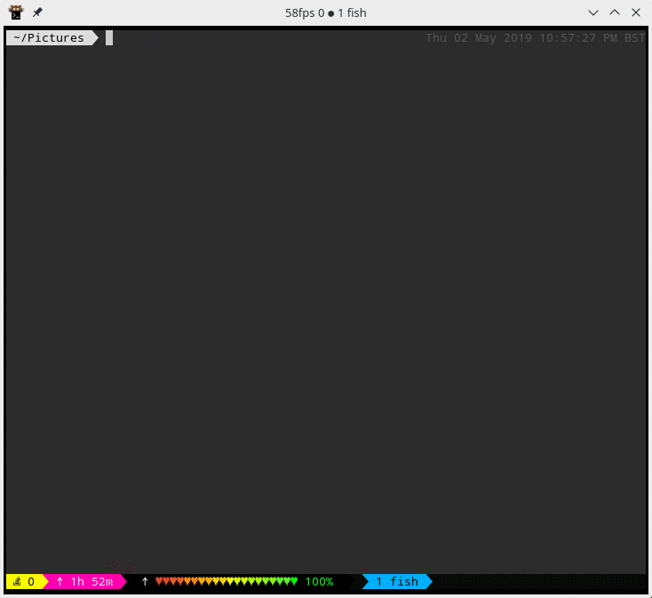
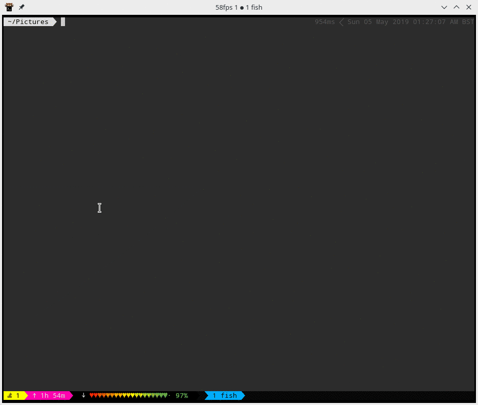

# viu

### Description
A small command-line application to view images from the terminal written in Rust.
It uses lower half blocks (▄ or \u2584) to fit 2 pixels into a single cell by adjusting foreground and background colours accordingly.


Features (see [Usage](#usage)):
- Animated GIF support
- Accept media through stdin
- Custom dimensions

### Installation

#### From source
Installation from source requires a local [Rust environment](https://www.rust-lang.org/tools/install).

```bash
git clone https://github.com/atanunq/viu.git

# Build & Install
cd viu/
cargo install --path .

# Use
viu img/giphy.gif
```
Or without cloning:
```bash
cargo install viu
```
#### Binary
A precompiled binary can be downloaded from the [release page](https://www.github.com/atanunq/viu/releases/latest).

#### Packages

##### Arch Linux
There is an [AUR package available for Arch Linux](https://aur.archlinux.org/packages/viu/).

### Usage






Ctrl-C was pressed to stop the GIFs.


Examples:

- `viu img/giphy.gif`
- `viu img/*`


The shell will expand the wildcard above and *viu* will display all the images in the folder one after the other. For a more informative output when dealing with folders the flag **-n** could be used.

When `viu` receives only one file and it is GIF, it will be displayed over and over until Ctrl-C is pressed. However, when couple of files are up for display (second example) the GIF will be displayed only once.

##### Aspect Ratio
If no flags are supplied to *viu* it will try to get the size of the terminal where it was invoked. If it succeeds it will fit the image and preserve the aspect ratio. The aspect ratio will be changed only if both options **-w** and **-h** are used together.

##### Command line options
```
USAGE:
    viu [FLAGS] [OPTIONS] <FILE>...

FLAGS:
    -m, --mirror     Display a mirror of the original image
    -n, --name       Output the name of the file before displaying
    -v, --verbose    Output what is going on

OPTIONS:
    -h, --height <height>    Resize the image to a provided height
    -w, --width <width>      Resize the image to a provided width

ARGS:
    <FILE>...    The image to be displayed
```

#### TODOs:
- [x] Reimplement STDIN image support based on [#7](https://github.com/atanunq/viu/pull/7)
- [ ] Use [crossterm](https://github.com/TimonPost/crossterm) to add Windows support and remove magic terminal escape sequences
- [ ] Tests
